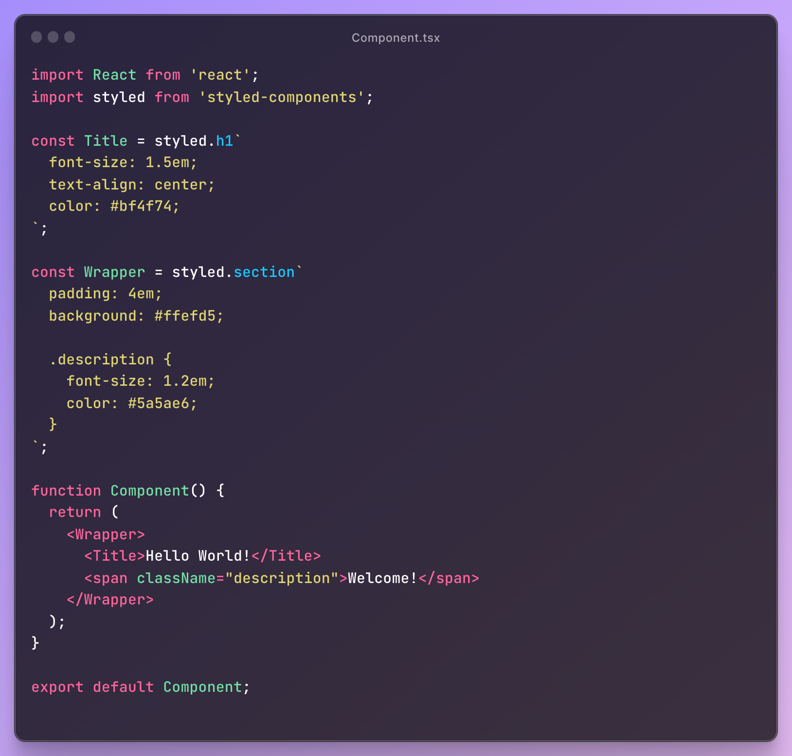

# tailwind-converter

Extracts the styles of a component defined through styled-components, 
converts it into a tailwind utility classes, and injects it into the 
className property of that element.

_This is a converter library designed to automate parts of the work
process for the productivity of developers working on the transition
from styled-components to tailwindCSS._

_I've tried to cover a variety of code-writing methods, but I admit
it's not perfect. I recommend you to use it to the extent that you get help,
and I promise to improve it steadily._

_I hope it can be of little help._

## Example

- Before



- After


## Installation

This library provides a shell script. recommend a global installation for convenience.

```sh
~$ npm install -g @youthfulhps/tailwind-converter
```
```sh
~$ yarn add -g @youthfulhps/tailwind-converter
```
```sh
~$ pnpm add -g @youthfulhps/tailwind-converter
```

## Usage

```sh
~$ tailwind-converter --target ${target file directory}

# example
~$ tailwind-converter --target ./src/components/Component.jsx
```

## Limitation

**Parameters passed to a tagged template literal function (styled) include 
interpolation for conditional style definitions.**
In this case, we're thinking about how to approach it, but because there's a 
lot of room for issues, the current version only converts the simple style definition, 
and the defined component using styled-components also retain the definition.


